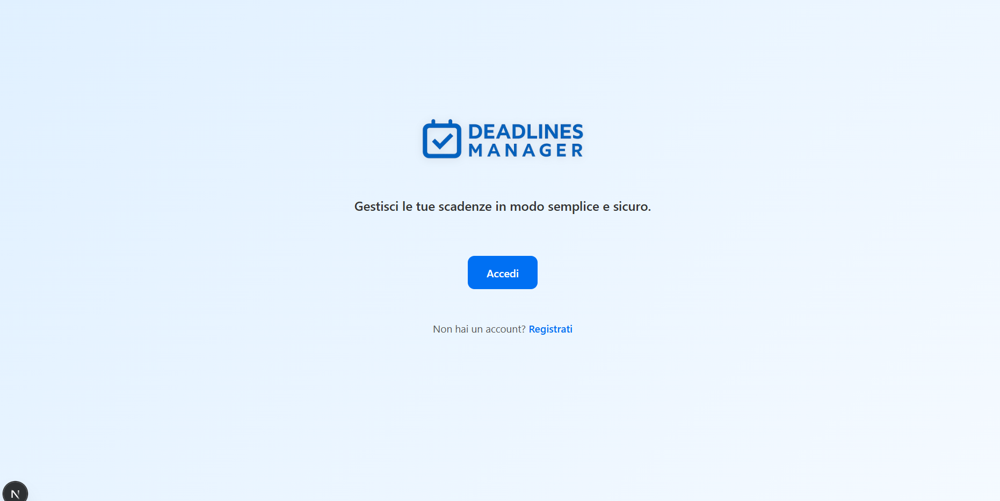
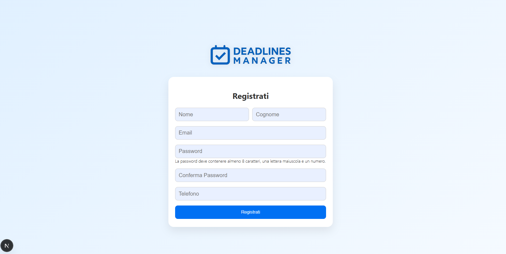
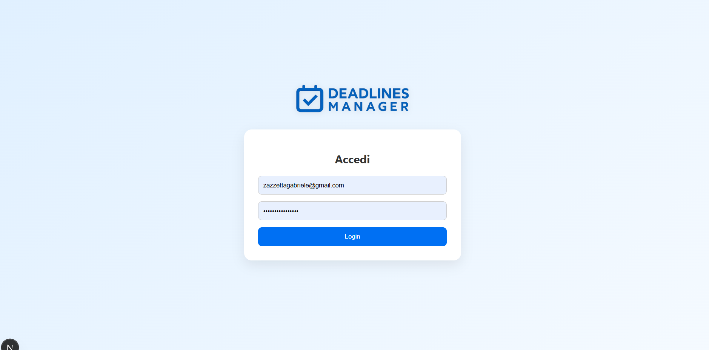
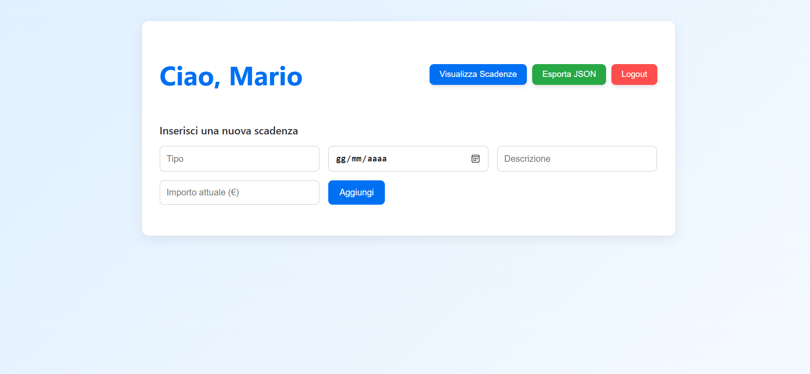
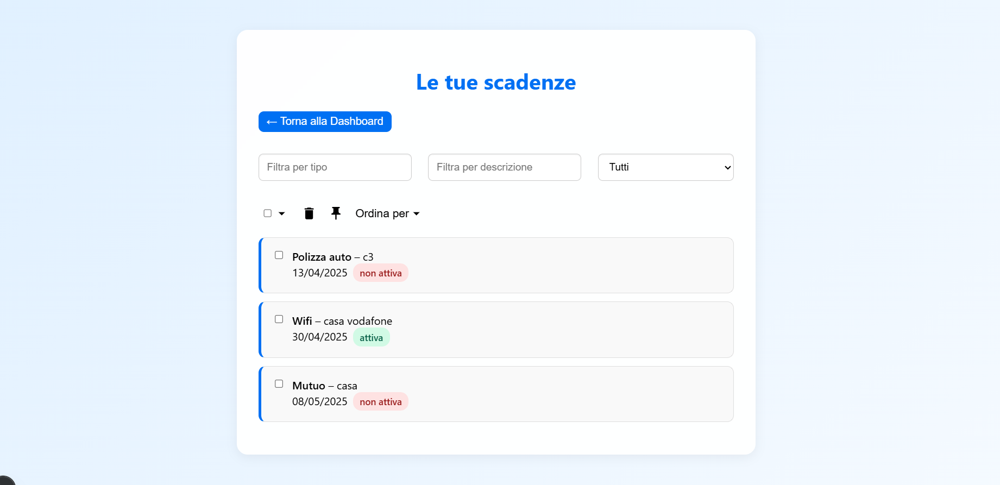
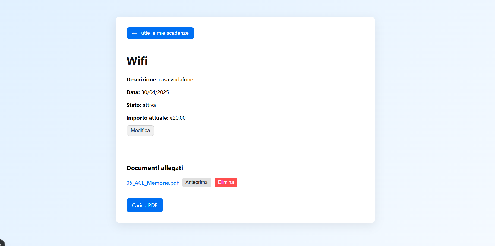

# Deadlines Manager

**Deadlines Manager** è un'applicazione web full-stack per la gestione delle scadenze personali, come abbonamenti, polizze, iscrizioni e pagamenti ricorrenti.

---

## Tecnologie utilizzate

| Frontend       | Backend        | Database | Email API   |
|----------------|----------------|----------|-------------|
| React.js (Next.js) | Node.js + Express | MySQL    | Sendinblue  |
| HTML/CSS/JSX   | JSON REST API  | — | —  |

## Setup e Dipendenze

Installazioni e configurazioni principali
1. **Node.js**
   - Scaricato e installato dal sito ufficiale: [https://nodejs.org](https://nodejs.org)

2. **Inizializzazione progetto**
   ```bash
   npm init -y
   ```

3. **Installazione dipendenze principali**
    
    React e ReactDOM
    ```bash
    npm install react react-dom
    ```

    Express per backend
    ```bash
    npm install express
    ```

    TypeScript
    ```bash
    npm install -g typescript
    npm install typescript --save-dev
    ```

    Next.js
    ```bash
    npx create-next-app deadlines
    ```

4. **Script in package.json**
    ```bash
    "scripts": {
    "dev": "next dev",
    "build": "next build",
    "start": "next start"
    }
    ```

5. **Autenticazione con NextAuth**
    ```bash
    npm install next-auth
    ```

    - Creazione file: pages/api/auth/[...nextauth].js
    - Configurazione provider (email/password) e connessione MySQL

6. **Sicurezza**

    Gestione password con
    ```bash
    npm install bcrypt
    ```

7. **Databse**
    
    Connessione con
    ```bash
    npm install mysql2
    ```

    Gestione upload PDF con
    ```bash
    npm install formidable
    ```

8. **Material UI(UI/UX)**
    ```bash
    npm install @mui/icons-material @mui/material @emotion/react @emotion/styled 
    ```
9. **Invio Email con Sendinblue (Brevo)**
    ```bash
    npm install @getbrevo/brevo
    ```

    - Usato per inviare email automatiche di promemoria in prossimità delle scadenze (1, 15 e 30 giorni prima).
    - Configurato nello script `sendReminders.js`


## Struttura del progetto

```plaintext
📁 pages/
├── api/
│   ├── auth/
│   ├── scadenze/
│   ├── send-email.js
│   ├── sendReminders.js
│   └── upload.js
├── _app.js
├── dashboard.js
├── index.js
├── login.js
├── register.js
├── visualizza.js

📁 styles/
├── global.css
├── Dashboard.module.css
├── DettaglioScadenza.module.css
├── global.css
├── Home.module.css
├── Login.module.css
├── Register.module.css
├── Visualizza.module.css

📁 public/
├──uploads/
│   ├── ...
│   ├── ...
├── logo.png

.env.local  
.gitignore
README.md  
package.json
package-lock.json
```

## Funzionalità

- Registrazione utenti con nome, email, password e numero di telefono.
- Aggiunta di nuove scadenze con tipologia, descrizione, data, importo e stato (attivo di default).
- Possibilità di aggiungere un campo 'Premio anno passato' per le scadenze di tipo polizza.
- Visualizzazione, modifica ed eliminazione delle scadenze personali.
- Filtri avanzati per tipo, descrizione e stato.
- Possibilità di "pinnare", ordinare e selezionare più scadenze contemporaneamente.
- Dettagli delle scadenze con la possibilità di caricare più file PDF e visualizzare l'anteprima.
- Notifiche email automatiche all'indirizzo di registrazione dell'utente tramite Sendinblue: 30, 15 e 1 giorno prima della scadenza.

## Pagine web

**Homepage**


**Registrazione**


**Login**


**Dashboard**


**Visualizza Scadenze**


**Dettaglio Scadenza**


## Installazione

Clona il progetto
```bash
git clone https://github.com/GabrieleZazzetta/DeadlinesManager.git
cd DeadlinesManager
```

Installa le dipendenze
```bash
npm install
```

Avvia il progetto in locale
```bash
npm run dev
```

## Configurazione Ambiente e Sicurezza
1. Crea un file .gitignore per escludere file sensibili quando si fa push su gitHub.

2. Crea un file .env.local nella root del progetto con le seguenti variabili:
    ```bash
    BREVO_API_KEY=your-api-key
    MYSQL_HOST=localhost
    MYSQL_USER=root
    MYSQL_PASSWORD=
    MYSQL_DB=database_name
    ```


© 2025 - Gabriele Zazzetta · Progetto Tecnologie Internet